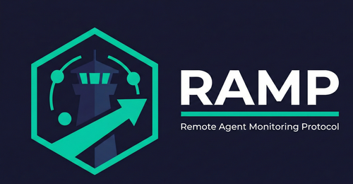
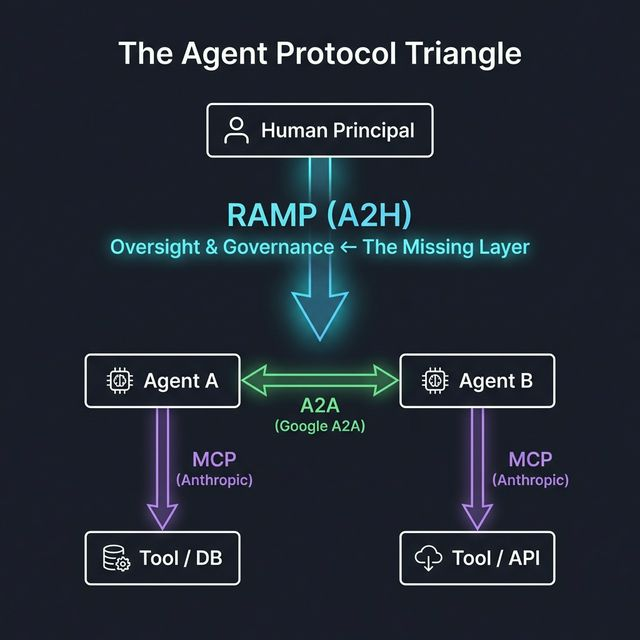

<div align="center">
  
  <h1>RAMP: Remote Agent Monitoring Protocol</h1>
  <p><strong>The open standard for Agent-to-Human communication.</strong></p>

  
  
  

  **Author:** [Fahad Deshmukh](https://github.com/fahaddeshmukh)
</div>

---

## Quickstart

RAMP agents use three methods: **report state**, **send notifications**, and **request human approval**.

```python
from ramp_sdk import RampAgent, ActionOption, RiskAssessment

agent = RampAgent(
    agent_id="agent:flight_search",
    gateway_url="http://localhost:8000",
    api_key="your-api-key",
    principal_id="user:you",
)

async with agent:
    # 1. Report progress
    await agent.send_telemetry(state="EXECUTING", task_description="Searching flights...")

    # 2. Notify the human
    await agent.send_notification(title="Found 3 flights", body="Delta, United, American")

    # 3. Request approval (blocks until human responds or timeout)
    response = await agent.request_action(
        title="Book Delta DL-402?",
        body="$420, non-refundable. Card ending ••33.",
        options=[
            ActionOption(action_id="book", label="Book Flight"),
            ActionOption(action_id="skip", label="Cancel"),
        ],
        risk=RiskAssessment(risk_level="high", reversibility="irreversible", estimated_cost_usd=420.0),
        timeout_seconds=300,
        fallback_action_id="skip",
    )

    if response.selected_action_id == "book":
        print("Human approved — booking now.")
```

### Run the Example

```bash
# Terminal 1 — start the gateway
cd gateway && pip install -e . && uvicorn app.main:app --reload

# Terminal 2 — run the example agent
cd sdk && pip install -e . && python ../examples/flight_agent.py
```

The agent will send telemetry, find flights, and ask you to approve a booking. Approve or deny via the gateway's pending actions API:

```bash
# List pending actions (the response includes each action's message_id)
curl http://localhost:8000/ramp/v1/actions/pending

# Approve the action — replace MSG_ID with the `message_id` value from the
# pending actions list above (e.g. "01936d87-7e1a-7f3b-a8c2-4d5e6f7a8b9c")
curl -X POST http://localhost:8000/ramp/v1/actions/MSG_ID/resolve \
  -H "Content-Type: application/json" \
  -H "X-RAMP-API-Key: ramp-demo-key-2026" \
  -d '{"resolution": "approved", "selected_action_id": "book"}'
```

---

## Core Concepts

### Roles

RAMP defines three architectural roles:

| Role | What it is |
|---|---|
| **Human Principal** | The person with authority over one or more agents. Sets governance policies, approves consequential actions, and receives real-time notifications. |
| **Agent** | The autonomous AI system performing tasks on behalf of the Principal. Reports telemetry, sends notifications, and requests human approval before taking high-risk actions. |
| **Gateway** | The infrastructure intermediary that enforces governance policies, routes messages between Agents and Principals, and maintains the tamper-evident audit trail. Every RAMP message passes through the Gateway. |

### Primitives

These three roles communicate through five primitives, organized around three functions — **Observe**, **Decide**, and **Govern**:

### Observe — What is the agent doing?

| Primitive | Direction | Purpose |
|---|---|---|
| **Telemetry** | Agent → Human | Report lifecycle state, progress, and resource usage. The agent's heartbeat. |
| **Notifications** | Agent → Human | Inform about events, completions, and warnings. One-way, no response needed. |

### Decide — Should the agent do this?

| Primitive | Direction | Purpose |
|---|---|---|
| **Action Requests** | Agent ↔ Human | Ask for an explicit human decision. Structured options, risk assessment, mandatory timeout with safe fallback. The core HITL mechanism. |

### Govern — What is the agent allowed to do?

| Primitive | Direction | Purpose |
|---|---|---|
| **Governance Policies** | Human → Gateway | Declarative rules constraining agent behavior: spending limits, capability permissions, operating hours, rate limits. Enforced at the Gateway before the human even sees the request. |
| **Audit Trail** | System → Record | Tamper-evident, hash-chained log of every agent action and human decision. Compliance-ready. |

### How RAMP composes with MCP and A2A

| Protocol | Question it answers |
|---|---|
| **MCP** (Anthropic) | *What can the agent access?* — Tools, resources, context |
| **A2A** (Google) | *How do agents coordinate?* — Inter-agent delegation |
| **RAMP** | *What is the agent about to do, and does a human need to approve it?* — Oversight, governance, HITL |

RAMP does not replace MCP or A2A. It fills the missing **Agent-to-Human** layer. An agent might use MCP to access a flight booking API (tool access), then use RAMP to get human approval for the specific booking (action authorization).

---

## What is RAMP?

The AI ecosystem has standardized how agents talk to **tools** ([Anthropic MCP](https://modelcontextprotocol.io/)) and how agents talk to **each other** ([Google A2A](https://github.com/google/a2a)).

**RAMP** is the standard for how agents talk to **humans**.

<div align="center">
  
</div>

### Why RAMP?

Without RAMP, deploying autonomous agents at scale leads to:
- **Notification fatigue** — agents dumping approvals into Slack/Telegram with no structure.
- **Zero auditability** — no tamper-evident record of what an agent did and who approved it.
- **No governance** — nothing stops an agent from spending $10,000 autonomously.

**With RAMP, you get:**
1. **Standardized Telemetry** — A unified view of every agent running on your behalf.
2. **Action Requests (HITL)** — A secure, timeout-enforced protocol for agents to request explicit human approval.
3. **Declarative Governance** — A gateway-level policy engine enforcing spending limits, capability permissions, and operating hours across your entire agent fleet.
4. **Tamper-Evident Audit Trail** — A hash-chained record of every agent action and human decision.

---

## Repository Structure

| Path | Contents |
|---|---|
| `/docs/ramp_protocol_spec_v2.md` | The complete RAMP v0.2 Protocol Specification |
| `/docs/concept.md` | Project concept and two-layer architecture overview |
| `/docs/advanced_architecture.md` | Advanced architecture: local agents, enterprise deployments, fleet dashboards |
| `/sdk/` | Python RAMP SDK |
| `/gateway/` | FastAPI Reference Gateway (policy enforcement, HMAC, audit trail) |
| `/examples/` | Runnable example agents demonstrating HITL flows |

---

## Enterprise & Compliance

RAMP is designed to support compliance with the human oversight requirements of the **EU AI Act (Article 14)** and **ISO/IEC 42001**. All Action Requests and telemetry pass through the Gateway, generating an immutable, hash-chained audit trail of exactly what an agent requested and which human approved it.

> **Note:** Formal regulatory conformance mappings are planned for future versions. This draft establishes the architectural foundations for such mappings.

---

## Contributing

We invite the AI framework community (LangChain, CrewAI, AutoGen, LlamaIndex) to review the spec and propose integrations. Open an issue or PR.

**License:** Apache 2.0
